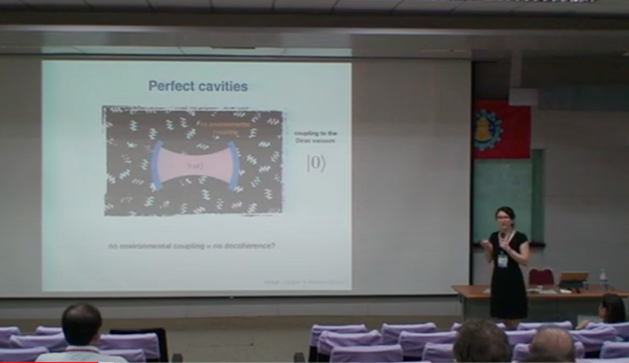
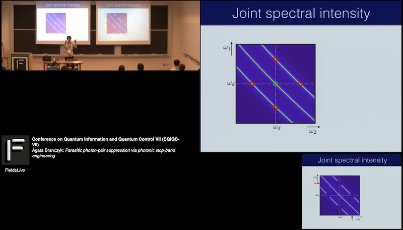

Over the years, I've given 40+ talks including 2 departmental colloquia, and 15 other invited talks. Some of these were recorded and are available here.

### Visualizing Quantum Light

_Kitchener-Waterloo Quantum Technologies Enthusiasts Meetup (20 Aug, 2020)_   

It's common to think of photons as "particles of light". It turns out that photons are nothing like ordinary particles. Not only do they have the familiar "quantum quirks" that electrons have (being able to be in a superposition of here and there, or being able to become entangled), but they are even more weird. Photons can be in superpositions of one, two, and three (or more) particles.   

These features make it difficult to conceptualize quantum light, so physicists had to develop new visualization tools to help. In this talk, I will share with you a popular visualization tool in Quantum Optics called the Wigner function. I'll show you how to use it to represent various interesting states of quantum light that are generated in labs today. I'll also give you a flavour for why it's useful for developing intuition. I'll try to do this without being very technical, and I promise pretty pictures.    

[Link to video on google drive](https://drive.google.com/file/d/15U3fb59Ksz-rfU4RoHlGcrwGWGN5Htq4/view)  

[pdf slides](https://www.agatabranczyk.com/files/Branczyk_Visualizing_Quantum_Light_KW_Quantum_20200820.pdf) (~14 MB)

  

### Quantum Trajectories (Where do opportunities come from?)

_Women in Quantum Summit (28 Jul, 2020)_   

We all have our unique career trajectories.   

Mine took me from helping launch a rocket in the Australian desert to helping a new generation of scientists discover their own career trajectories in Canada.   

In between, there was a lot of quantum optics (there still is!). There were also a few surprises.   

In this talk, I share my adventures. I also discuss our [Career Trajectories](https://perimeterinstitute.ca/training/trajectories-careers-physicists) program at [Perimeter Institute](https://www.perimeterinstitute.ca/), which connects physics students and postdocs with opportunities in industry.   

Finally, I take the opportunity to share some insights I picked up along the way.

<iframe width="800" height="450" src="https://www.youtube.com/embed/r4ipeNJc604" frameborder="0" allow="accelerometer; autoplay; encrypted-media; gyroscope; picture-in-picture" allowfullscreen></iframe>
 

### Customizing Quantum Light Sources for Emerging Quantum Technologies

_Qiskit Seminar (24 Jul, 2020)_   

Light moves at nature's speed limit, and doesn't degrade for hundreds of kilometres, making it our best medium for sending information over long distances. But to send quantum information, we will require quantum light.   

Sources of quantum light based on nonlinear optical processes, which mediate interactions between photons, are becoming an established standard for generating single photons and other important quantum states of light. While existing sources were sufficient for proof-of-principle experiments, and to demonstrate the feasibility of optics for quantum technologies, significant progress in the field will require a much higher degree of control over quantum light.   

In this talk, I will focus on a particular kind of nonlinear process known as Spontaneous Parametric Downconversion (SPDC). I will discuss the various steps that go into shaping the joint spectral properties of light generated by SPDC. I will then describe a novel technique-customized poling-which brings joint spectral shaping to the next level.   

[pdf slides](https://www.agatabranczyk.com/files/Branczyk_Qiskit_seminar_20200624.pdf) (~9 MB)

<iframe width="800" height="450" src="https://www.youtube.com/embed/_rky-bqrlDo" frameborder="0" allow="accelerometer; autoplay; encrypted-media; gyroscope; picture-in-picture" allowfullscreen></iframe>
 

### Charged-vacuum-induced decoherence of quantum states of light

_Conference on Relativistic Quantum Information - North (RQI-N) (31 May, 2019)_   

Standard quantum optics predicts that a quantum state of the electromagnetic (EM) field prepared in an ideal cavity will not decohere. This is because decoherence requires coupling of the system to an environment, whereas the EM state of an ideal cavity is completely isolated from any external EM modes. But could coupling of the EM cavity modes to other fields induce decoherence, even in an ideal cavity? Specifically, could vacuum fluctuations from the Dirac vacuum cause the EM cavity state to decohere?   

We show that the answer is yes: even in the absence of environmental noise, quantum-optical states can decohere. Specifically, we demonstrate that a single-mode Schrödinger cat state prepared in an ideal cavity—i.e. a cavity whose internal EM modes are not coupled to any external EM modes—can decohere due to interactions with the vacuum state of a scalar charged field.   

Intuition from particle physics does suggest that there should be a fundamental loss of coherence of light due to its interaction with charged fermion field vacua via, for example, vacuum polarization (the Schwinger effect). But we show that this intuition fails to predict the right scales at which this would happen: for short interaction times and small interaction regions, EM field states decohere much earlier than the energy scales for which vacuum polarization happens. Our results therefore imply a fundamental limit on the speed and density of quantum gates inside an optical quantum computer.   

[Link to video on YouTube](https://youtu.be/0D8LebZ5apc)

  

### Parasitic photon-pair suppression via photonic stop-band engineering

_Conference on Quantum Information and Quantum Control VII (CQIQC-VII) (29 Aug, 2017)_   

Spectrally degenerate photons are an important resource in optical implementations of quantum information processing as well as fundamental tests of bosonic interference. For integration with existing infrastructure, it is desirable that they be produced via spontaneous four-wave mixing (SFWM), a process that comes in two distinct flavors: single-pump and dual-pump.   

Achieving simultaneous generation of spectrally degenerate photons using single-pump SFWM is challenging, for it requires simultaneously heralding a photon from each of two photon-pair sources. Dual-pump SFWM, on the other hand, can directly produce pairs of spectrally identical photons. Unfortunately, to date degenerate photon-pair generation via dual-pump SFWM has suffered from noise due to each pump generating its own parasitic pairs of non-degenerate photons via single-pump SFWM.   

In this talk, I discuss the use of a Bragg grating to suppress these undesired single-pump processes. We calculate that an appropriate modification of the field associated with only one of the photons of a photon pair can suppress generation of the pair entirely. From this general result, we develop a method for suppressing the generation of undesired photon pairs utilizing photonic stop bands. These results open a new avenue for photon-pair frequency correlation engineering.   

[Link to video at Fields Live Video](http://www.fields.utoronto.ca/video-archive/2017/08/2405-17470) (needs Adobe Flash Player)

  

### Pure heralded single photons

_Conference on Quantum Information and Quantum Control VII (CQIQC-VI) (17 Aug, 2015)_   

The generation of pure non-classical states of light is one of the most important goals of optical quantum information science. At present, the most popular method for generating quantum light relies on spontaneous parametric downconversion (SPDC)—a nonlinear process that converts high-energy photons into pairs of lower energy photons. Photon sources based on SPDC have widespread application in many quantum technologies. The ability to control the characteristics of quantum states of light becomes increasingly important as these experiments mature. In particular, the generation of high-purity heralded single photons will require careful engineering of the joint spectral correlations of the generated photon pairs.   

The most common method for modifying the shape of the joint spectral amplitude is filtering, however, this can lead to photon loss, which can in turn degrade the purity of the generated quantum state. More sophisticated methods involve shaping the spectrum at the source using techniques such as qausi-phasematching. However, these are limited by undesirable diagonal side-lobes in the joint spectrum. Modest filtering is still required to achieve high spectral purity.   

We use simulated annealing to find an optimized crystal poling configuration which allows almost arbitrary shaping of the crystal's phase-matching function. By customizing the poling configuration to generate a phase-matching function that closely approximates a Gaussian profile, we increase the heralded photon purity to P=0.999. This provides an order of magnitude improvement over previous schemes.   

[Link to video at Fields Live Video](http://www.fields.utoronto.ca/video-archive/2015/08/382-4951) (needs Adobe Flash Player)

  

### Holistic Tomography

_Workshop on Mathematical Methods of Quantum Tomography (19 Feb, 2013)_   

Quantum state tomography is the characterization of a quantum state by repeated state preparation and measurement. It relies on the ability to prepare well-characterized unitary operations to change the measurement basis. Conversely, quantum process tomography is the characterization of a quantum process, relying on the preparation of well-characterized quantum states. While parallels between state and process tomography are well-known, the two have largely been treated independently. In the last year, however, we saw the development of a number of more holistic approaches, where unknown parameters in both the state and process are treated on an equal footing. I will discuss advances made in these approaches, focusing on our results for unitary processes, and look to the future with a discussion of open problems and possible future directions.   

[Link to video at Fields Live Video](https://www.fields.utoronto.ca/video-archive/2013/02/119-1377) (needs Adobe Flash Player)

